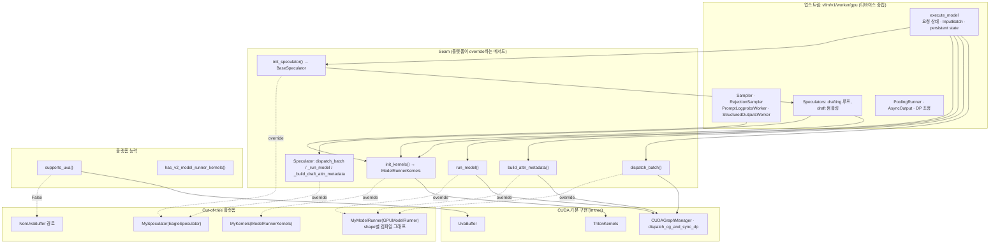
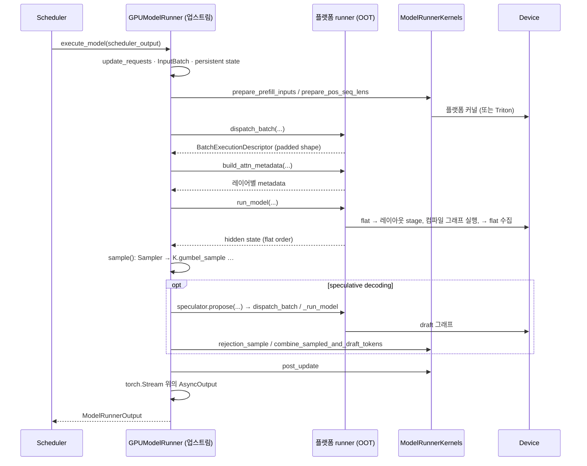

# Model Runner V2: Out-of-Tree 플랫폼 설계

English version: [model_runner_v2_oot_platforms.md](model_runner_v2_oot_platforms.md)

## 요약

[Model Runner V2](model_runner_v2.md)(MRV2)는 CUDA를 전제로 처음부터 다시 설계되었다. 그런데 그 내용의 대부분은 CUDA와 무관하다. 요청 상태 관리, persistent batch, block table, 샘플링 알고리즘, speculative decoding 루프, structured outputs, pooling이 그렇다. CUDA에 묶인 것은 나머지 작은 부분이다. Triton 커널, CUDA graph manager, UVA, 그리고 stream과 event 객체의 선택이다.

이 문서는 CUDA가 아닌 플랫폼이 MRV2를 복사하거나 monkey-patch하지 않고 끼워 넣는 방법을 제안한다. 제안의 핵심은 하나다. **MRV2는 알고리즘을 소유하고, 플랫폼은 디바이스를 소유한다.** 둘 사이의 경계는 업스트림이 만들고 플랫폼이 override하는, 이름 붙은 소수의 seam이다. 업스트림에 남는 것은 모두 디바이스 중립이고, 플랫폼이 공급하는 것은 모두 seam을 통해서만 닿는다.

이 설계는 백지에서 쓴 것이다. 현재 코드를 기술하는 문서가 아니며, 부분 구현이 존재한다는 사실은 마지막에 참고로만 언급한다.

## 동기: out-of-tree 플랫폼들이 오늘 하고 있는 일

CUDA 밖에서 vLLM worker를 돌리는 플랫폼은 모두 같은 문제를 각자 풀었고, 그 해법은 서로 닮았다. 아래 표는 명시한 커밋의 저장소를 직접 읽은 것이고, 인용은 유지자 본인의 말이다. 파일 참조는 `path@commit:line` 형식이다.

| 플랫폼 | Runner | 업스트림을 어떻게 맞추는가 |
| --- | --- | --- |
| vllm-ascend `86ac840b` | V1: `NPUModelRunner(GPUModelRunner)`, 6,258줄. V2: subclass 953줄에 더해, sampler와 모든 speculator를 다시 구현한 병렬 트리 `worker/v2/{sample,spec_decode}/`. | patch 모듈 60개(V2용 13개)와 1,564줄짜리 카탈로그(`vllm_ascend/patch/__init__.py`). `torch.cuda.*` 12개 속성을 `torch.npu.*`로 프로세스 전역 alias, `finally: pass`(`worker/v2/utils.py@86ac840b:17-37`). |
| vllm-gaudi `e487250` | `HPUModelRunner` 7,907줄, `GPUModelRunner`를 상속하지 않음. "Copied from vllm/v1/worker/gpu_model_runner.py"로 표시된 메서드들(`hpu_model_runner.py:3952`). | 카탈로그된 런타임 patch 11개, 각각 그것을 강제한 업스트림 PR에 고정(`vllm_gaudi/patches.py`). README: "upstream API updates may introduce compatibility issues." |
| vllm-neuron `f8abae6` | `NeuronModelRunner` 9,086줄. `_update_states`는 "copied VERBATIM from upstream ... DO NOT modify it directly"(`neuron_model_runner.py:1908-1910`). | patch를 import 시점에 적용, "so they survive spawn-mode re-imports". vLLM 버전마다 release 브랜치 하나. |
| tpu-inference `7bb0af8` | JAX runner 3,455줄과 manager들. 자체 sampler와 speculator. | `torch.accelerator.empty_cache / get_memory_info / synchronize`를 모듈 수준에서 monkeypatch. 유일하게 재사용하는 GPU 클래스는 subclass해서 "override only the two device-bound methods, inheriting everything algorithmic"(`runner/mm_encoder_jit_manager.py:8-16`). |
| Spyre(`sendnn-inference` `f488d54`) | 백지에서 작성, 2,062줄. | `del sys.modules["triton"]`, stream placeholder, `vllm>=0.26.0,<0.27.2`. |
| vllm-mlu `dc984838`(V1만) | `MLUModelRunner(GPUModelRunner)` 4,166줄. `execute_model`, `sample_tokens`, `propose_draft_token_ids`를 override. | 45개 모듈에 걸친 `apply_hijack` `setattr` 호출 125개. |
| vllm-metax `17c4cc4b` | CUDA 계열 디바이스. runner는 메서드 하나 외에 건드리지 않음. | patch 파일 41개와 날짜가 찍힌 patch별 감사 문서(`vllm_metax/patch/AUDIT.md`). |
| in-tree XPU, CPU `ff3c9cb` | 둘 다 `GPUModelRunner`를 subclass. | XPU는 `super().__init__()` 주위에서 `torch.cuda.Stream / Event / graph / CUDAGraph`를 `torch.xpu.*`로 재바인딩(`xpu_model_runner.py:43-63`). CPU는 `_StreamPlaceholder` / `_EventPlaceholder`를 설치하고 커널 객체를 C++로 재바인딩(`cpu_model_runner.py:65-110`). |

여덟 가지 패턴이 반복된다. 각 항목은 그것에 답하는 아래의 원칙이나 seam을 가리킨다.

1. **runner 수준의 확장점이 없어서 모든 플랫폼이 runner를 통째로 소유한다.** `docs/design/plugin_system.md`는 `worker_cls`만 제공하고 그 아래는 없다. `gpu_worker.py@ff3c9cb:146-147`은 runner import를 하드코딩한다. MRV2가 오늘 가진 유일한 seam은 `pcp_manager_cls`다(`gpu/model_runner.py:2304-2306`). [RFC #51212](https://github.com/vllm-project/vllm/issues/51212): "in practice each backend ends up copying the entire GPU model runner and maintaining it independently ... ~8000 lines." 원칙 1~3과 실행 seam이 답한다.

2. **subclass를 무력화하는 것은 업스트림 클래스가 아니라 업스트림 호출 지점이다.** vllm-ascend는 `InputBatch`를 patch하는데 이유는 "vllm use InputBatch to make dummy tensors. in `model_runner.py` and `cudagraph_utils.py` which make it difficult to inherit from vllm methods"(`patch/__init__.py@86ac840b:1319-1320`)이고, `BlockTables`, `init_model_state`, `get_kv_cache_spec`도 같은 이유로 patch한다. RFC #51212: "The runner creates internal components ... by directly instantiating GPU-specific classes. A backend that needs its own version has to `del` the GPU object and recreate it in `__init__`." Ascend의 patch 두 개는 글자 그대로 "a backend-dispatchable spec-decode graph manager abstraction"을 요청한다(`:1300-1313`). 원칙 3과 I3의 `init_*` factory, 그리고 graph manager 대신 결정과 실행에 seam을 두는 것이 답한다.

3. **Triton이 가장 큰 단일 대체 원인이고, 모듈 속성 대입으로 대체된다.** `patch/worker/patch_v2/patch_triton.py@86ac840b:41-76`은 심볼 18개를 재바인딩하는데, `gumbel_sample`은 모듈 다섯 곳, `compute_topk_logprobs`는 세 곳에서 그렇게 한다. "because sampler.py and speculator.py are imported before this patch, they must be overridden"(`:42`). 카탈로그의 이유는 "there is no dispatch mechanism for triton ops"(`:1355-1368`)다. in-tree CPU도 커널 객체에 같은 일을 한다. [RFC #45133](https://github.com/vllm-project/vllm/issues/45133)은 다시 쓴 커널을 55개로 센다. Kunlun 유지자: "the Triton code in v2 is blocking this process." Tenstorrent 유지자: "What non-GPU backends need is a Torch-native `rejection_sample` reference plus a class-level seam, not per-platform Triton variants." 커널 인터페이스와 I1, I2가 답한다.

4. **V2 게이트 자체를 가져간다.** vllm-ascend는 `VllmConfig`의 멤버 넷, 즉 `use_v2_model_runner`, `_validate_v2_model_runner`, 그리고 미지원 기능 목록 둘을 대체한다. 업스트림이 V2를 켜는 기준이 "model architecture whitelists, Triton availability, and feature compatibility checks"라서 디바이스를 설명하지 못하기 때문이다(`patch/platform/patch_use_v2_model_runner.py@86ac840b:50-71`). `has_v2_model_runner_kernels()`와 원칙 4가 답한다.

5. **stream, event, `torch.accelerator`는 추상화되지 않고 alias된다.** Ascend는 두 번, in-tree XPU도 하고, in-tree CPU는 placeholder를 설치하고, Gaudi, TPU, Spyre는 각자 `torch.accelerator.empty_cache`를 patch하고, Neuron은 "to prevent CUDA fallthrough"를 위해 `torch.neuron.current_stream`을 가짜로 만든다. 이것들을 플랫폼으로 라우팅하자는 체크리스트([RFC #9268](https://github.com/vllm-project/vllm/issues/9268), 2024)는 아직 체크되지 않았고, 후속([RFC #20708](https://github.com/vllm-project/vllm/issues/20708))은 PR이 merge되지 않은 채 닫혔다. 원칙 5, 즉 라우팅이 필요 없는 torch의 일반 API가 답한다.

6. **UVA는 구현이 하나뿐이고 fallback이 없다.** vllm-ascend가 자기 171줄짜리 `UvaBuffer` 대체물을 지우자고 낸 RFC([#14209](https://github.com/vllm-project/vllm-ascend/issues/14209)): "The upstream implementation only supports CUDA/XPU accelerator views and has no device-independent fallback." 수용 기준: "No vLLM `UvaBuffer` symbol is replaced." `supports_uva()`와 `NonUvaBuffer` 경로가 답한다.

7. **pipeline parallelism은 플랫폼이 상태 소유권을 두고 업스트림과 싸우는 곳이다.** vllm-ascend는 `super().__init__()` 주위에서 `pipeline_parallel_size = 1`로 바꿔 Spec+PP guard를 우회하고, 끝나면 되돌리고, 살아 있는 `PPHandler` 인스턴스에 대체 broadcast 메서드를 바인딩한다(`worker/v2/pp_utils.py@86ac840b:94-125`, `patch/worker/patch_v2/patch_spec_pp.py:44-48`). 그들의 [RFC #14179](https://github.com/vllm-project/vllm-ascend/issues/14179)는 "migrate PP speculative-decoding state ownership upstream"을 요청한다. PP를 명시적으로 CUDA로 남기고 플랫폼에 거부할 factory를 주는 것(I7)이 답한다.

8. **파손 빈도는 그 비용을 내는 사람들이 직접 말한다.** vllm-ascend: "CI breaks once a week on average"([RFC #22082](https://github.com/vllm-project/vllm/issues/22082)). "More and more env, additional config and patch are added to vLLM Ascend. It makes vLLM Ascend hard to be used and maintained"([#5304](https://github.com/vllm-project/vllm-ascend/issues/5304)). vllm-metax의 감사는 자기 patch 하나가 업스트림이 올바르게 고친 뒤에도 "reintroduced that obsolete behavior"했음을 찾아냈다. I8, 즉 CUDA CI를 회귀 테스트로 삼는 verbatim 이동과, 표 하나에 다 들어갈 만큼 seam 수를 작게 유지하는 것이 답한다.

### 열려 있는 업스트림 제안과의 관계

[RFC #51212](https://github.com/vllm-project/vllm/issues/51212)는 세 층을 제안한다. Triton 커널 dispatcher(RFC #45133, PR #43048), 교체 가능한 부품을 위한 `Platform` factory 메서드(PR #53895), 그리고 스텝별 runner hook인데 마지막은 "Not planned since this is much hack"으로 표시되어 있다. 코어 유지자의 리뷰: "very reasonable with the exception of layer 3; I fear this will be too invasive for the GPU model runner and will likely be hard to standardize as new features will continually adjust the hook signatures and placements."

이 설계는 그 반론을 받아들이고 각 층에 다르게 답한다.

- **이름을 key로 하는 dispatcher가 아니라, 타입이 있는 클래스 하나로 커널을 다룬다.** `ModelRunnerKernels`는 완전성을 정적 성질로 만들고(I2), 이름이 바뀐 커널을 시작 시점 실패로 만든다. #45133의 Tenstorrent 코멘트가 요청한 바로 그 형태다.
- **`Platform`의 부품 묶음이 아니라 runner의 factory.** runner가 생성하는 유일한 곳이므로(I3) 컴포넌트를 추가하는 일은 거기에 메서드 하나를 더하는 것이고, `Platform`은 worker 코드를 import하지 않는다.
- **hook 목록이 아니라, 이름이 결정인 실행 seam 세 개.** `dispatch_batch`, `build_attn_metadata`, `run_model`은 "무엇"이 "어떻게"로 바뀌는 지점이다. 새 기능은 seam의 기본 본문을 바꾸는데, 그 본문은 대체한 코드를 그대로 옮긴 것이므로 seam의 시그니처나 위치는 바뀌지 않는다.

디바이스 중립 runner를 향한 이전 시도들([#9268](https://github.com/vllm-project/vllm/issues/9268), [#11162](https://github.com/vllm-project/vllm/issues/11162), [#12992](https://github.com/vllm-project/vllm/issues/12992), [#20708](https://github.com/vllm-project/vllm/issues/20708), [#22082](https://github.com/vllm-project/vllm/issues/22082))은 모두 runner 부분을 landing하지 못하고 닫혔다. 그것들은 다시 쓰기로 범위를 잡았다. 이 제안은 옮기기로 범위를 잡는다.

## 목표와 비목표

목표:

- 모델이 shape별로 컴파일된 그래프로 실행되고 logits도 그래프 안에서 계산되는 플랫폼이, 요청 상태, 샘플링, speculative decoding, structured outputs, pooling, DP를 그대로 물려받아 MRV2를 실행한다.
- Triton이 없는 플랫폼이 커널을 객체 하나로 공급하고, 모듈 전역 심볼은 건드리지 않는다.
- CUDA에서의 in-tree 동작은 구조적으로 변하지 않는다. 모든 seam은 오늘 존재하는 코드를 그대로 옮긴 것이고, 모든 기본 구현은 오늘의 경로를 재현한다.
- 어떤 기능을 지원하지 못하는 플랫폼은 스텝 도중에 실패하는 대신 시작 시점에 그 기능의 이름을 대며 거부한다.

비목표:

- 실행을 `InputBatch` 위의 forward pass로 표현할 수 없는 플랫폼에서 MRV2를 돌리는 것. 그런 플랫폼은 자기 runner가 필요하다.
- CUDA graph를 추상화하는 것. graph capture는 CUDA 기능이고 그대로 남는다. 자체 컴파일 그래프 메커니즘을 가진 플랫폼은 manager가 아니라 실행 seam을 override한다.
- 모든 플랫폼에서 MRV2의 모든 기능을 지원하는 것. 예컨대 pipeline parallelism은 두 번째 디바이스 process group과 `Tensor.record_stream`이 필요하다. 그것이 없는 플랫폼은 PP를 다시 구현하지 않고 거부한다.

## 철학

아래 모든 질문은 다섯 가지 원칙으로 결정한다. 두 답이 비슷하게 좋아 보이면 이 원칙을 더 많이 따르는 쪽이 이긴다.

1. **runner는 알고리즘을, 플랫폼은 디바이스를 소유한다.** MRV2는 한 스텝에 *무엇*이 필요한지 결정한다. 어느 요청인지, 토큰이 몇 개인지, persistent state의 어느 행인지, 무엇을 샘플링할지. 플랫폼은 디바이스가 그것을 *어떻게* 하는지 결정한다. 어느 그래프를 돌릴지, 토큰을 그래프에 맞게 어떻게 배치할지, `gumbel_sample`을 어떤 커널로 구현할지. seam은 "무엇"이 "어떻게"로 바뀌는 바로 그 지점에 놓인다.

2. **seam은 flag가 아니라 메서드다.** 플랫폼은 무엇을 결정하는지 이름이 말해주는 메서드(`dispatch_batch`, `run_model`, `init_kernels`)를 override한다. MRV2는 분기를 고르기 위해 `current_platform.is_cuda()`나 `is_rbln()`을 묻지 않는다. flag는 업스트림 안에 로직의 두 번째 복사본을 만든다. 메서드는 업스트림에 복사본 하나를 두고 플랫폼의 복사본을 tree 밖, 원래 있어야 할 곳으로 보낸다.

3. **업스트림이 생성하고, 플랫폼이 선택한다.** runner가 필요로 하는 디바이스 종속 객체(커널 집합, speculator, sampler와 그 보조 객체)는 모두 runner의 factory 메서드로 생성된다. 플랫폼은 factory에서 자기 클래스를 반환한다. 생성 후에 속성을 바꿔 끼우지 않고, 경로로 심볼을 import해서 덮어쓰지 않고, MRV2가 객체를 만드는 순서를 알 필요도 없다.

4. **정체가 아니라 능력을 묻는다.** MRV2가 디바이스에 대해 무언가 알아야 할 때는 이름이 아니라 능력을 묻는다(`supports_uva()`, `has_v2_model_runner_kernels()`). 능력 하나의 뒤에는 정확히 하나의 fallback 경로가 있고, 그 경로는 실제 플랫폼이 그 능력을 갖지 못했기 때문에만 존재한다.

5. **기본은 디바이스 중립, CUDA 기능인 곳만 CUDA.** stream, event, 동기화는 torch의 일반 API(`torch.Stream`, `torch.Event`, `torch.accelerator`)를 쓴다. CUDA에서는 이전과 같은 객체다. `torch.cuda.*`는 기능 자체가 CUDA인 곳, 즉 graph capture와 cuBLAS handle에만 남는다. 이것은 포팅이 아니라 우연히 생긴 의존성의 제거다.

## 불변식

MRV2나 플랫폼의 어떤 변경에 대해서도 리뷰어가 점검할 수 있는 성질이다. 각각 검증 가능하다.

| # | 불변식 | 검증 방법 |
| --- | --- | --- |
| I1 | MRV2 스택의 어떤 모듈도 `gpu/kernels.py` 밖에서 `triton`을 호출하지 않는다. 모든 커널 실행은 `ModelRunnerKernels`를 거친다. | `vllm/v1/worker/gpu/` 아래에서 `kernels.py`와 그 자체가 CUDA 전용인 파일을 제외하고 `triton`을 grep. |
| I2 | `TritonKernels`의 public 메서드 집합은 `ModelRunnerKernels`의 abstract 메서드 집합과 같다. 업스트림이 커널을 추가하면 같은 변경에서 abstract로 선언한다. | 두 집합을 비교하는 단위 테스트. |
| I3 | 디바이스 종속 객체는 모두 runner의 `init_*` factory로 생성되고, runner 본문은 factory 기본값 외에 구체 디바이스 클래스를 import하지 않는다. | 코드 리뷰. factory 밖의 `Sampler(`, `RejectionSampler(` grep. |
| I4 | `vllm/v1/worker/gpu/`에 `is_<platform>()` 분기가 없다. | grep. |
| I5 | MRV2는 플랫폼에 flat token order로 `num_tokens_after_padding` 행을 넘기고 같은 형태로 돌려받는다. 다른 레이아웃을 쓰는 플랫폼은 `run_model` 경계에서만 변환한다. | speculator와 sampler는 flat order를 가정한다. 레이아웃이 새면 그 테스트가 실패한다. |
| I6 | 요청 상태, block table, `InputBatch`, 샘플링 알고리즘, drafting 루프는 플랫폼이 override하지 않는다. | 플랫폼 runner에 그 이름의 메서드가 없다. 리뷰. |
| I7 | 어떤 기능을 실행할 수 없는 플랫폼은 상태를 할당하기 전, `__init__`에서 기능 이름을 담은 `NotImplementedError`를 낸다. | 거부 기능별 단위 테스트. |
| I8 | 각 seam은 seam이 생기기 전에 실행되던 코드를 그대로 옮긴 것이고, 기본 구현은 인라인 코드와 바이트 단위로 동등하다. | seam PR마다 리뷰. CUDA CI가 회귀 테스트다. |

## 아키텍처



위에서 아래로 읽는다. 업스트림 상자는 플랫폼을 위해 바뀌지 않는다. seam 상자가 계약의 전부다. 메서드 여섯 개와 능력 질의 두 개. CUDA 상자는 seam의 기본 동작이다. out-of-tree 상자는 플랫폼이 작성하는 것인데, 작고, 그 안으로 들어오는 화살표는 모두 seam에서 출발한다.

## Seam

### 플랫폼 능력

`Platform`의 두 질문이, 그 능력이 없는 플랫폼을 위해 존재하는 경로를 연다.

`has_v2_model_runner_kernels() -> bool`은 `use_v2_model_runner`와 `_validate_v2_model_runner`의 `HAS_TRITON` 검사를 대체한다. 기본값은 `HAS_TRITON`이다. `ModelRunnerKernels`를 구현한 플랫폼은 `True`를 반환한다.

`supports_uva() -> bool`은 "pinned memory가 있다"를 UVA 검사로 쓰던 것을 대체한다. 기본값은 CUDA 계열이거나 pinned memory가 있는 XPU다. `False`이면 `UvaBuffer`가 기존 `NonUvaBuffer` 미러로 바뀌고, raw `data_ptr()` 테이블로 메모리를 접근하는 세 호출 지점(`FusedStagedWriter.apply`, `BlockTables.gather_block_tables`, `BlockTables.compute_slot_mappings`, 그리고 `StagedWriteTensor.apply_write`)은 Triton이 없을 때 텐서를 직접 인덱싱한다. 플랫폼 커널은 텐서를 받으므로 포인터 테이블을 역참조할 수 없기 때문이다.

runner 어디에도 `is_cuda()`는 없다. 세 번째 능력이 필요해지면 여기에 추가하고, 그 뒤에는 fallback을 정확히 하나만 둔다.

### 커널 인터페이스

MRV2 스택이 실행하는 모든 디바이스 커널은 abstract 클래스 하나의 메서드다.

```text
vllm/v1/worker/kernels.py          class ModelRunnerKernels(ABC)      # 계약
vllm/v1/worker/gpu/kernels.py      class TritonKernels(ModelRunnerKernels)   # CUDA, @triton.jit 본문 포함
```

runner는 `init_kernels()`에서 구현을 한 번 얻어, 커널을 실행하는 모든 컴포넌트에 넘긴다.

| 사용자 | 커널 |
| --- | --- |
| `GPUModelRunner` (입력 준비, post-update) | `prepare_prefill_inputs`, `prepare_pos_seq_lens`, `combine_sampled_and_draft_tokens`, `expand_idx_mapping`, `post_update`, `post_update_num_computed_tokens` |
| `Sampler`와 그 상태들 (temperature, min-p, penalties, logit bias, bad words, logprobs) | `apply_temperature`, `apply_min_p`, `apply_penalties`, `bincount`, `apply_logit_bias`, `apply_bad_words`, `gumbel_sample`, `compute_token_logprobs`, `compute_token_ranks`, `fill_logprob_token_ids`, `get_num_nans`, `get_num_sampled_and_rejected` |
| `PromptLogprobsWorker` | `get_prompt_logprobs_token_ids` |
| `RejectionSampler` | `rejection_sample`, `flatten_sampled` |
| `StructuredOutputsWorker` | `apply_grammar_bitmask` |
| `AutoRegressiveSpeculator` | `prepare_draft_prefill_inputs`, `prepare_draft_decode_inputs`, `update_draft_inputs`. draft 샘플링은 `gumbel_sample`을 재사용 |

인터페이스의 설계 규칙:

- **사용자별 클래스가 아니라 클래스 하나.** 플랫폼은 객체 하나를 제공한다. 사용자별로 인터페이스를 나누면 플랫폼은 클래스 다섯 개를 구현하고 runner는 factory 다섯 개를 노출해야 하는데 얻는 것이 없다. 커널들은 helper(`gumbel_sample`, `expanded_idx_mapping` 관례)를 공유하고, 플랫폼의 구현도 백엔드를 공유한다.
- **시그니처는 커널의 인자 그대로다. 커널이 포인터를 받던 자리에는 텐서, `constexpr`를 받던 자리에는 Python int.** CUDA 실행이 여러 필드를 읽는 곳에서는 `InputBuffers`와 `InputBatch`를 통째로 넘기고, 플랫폼이 필요한 것을 꺼낸다.
- **변경하는 커널은 `None`을, 생성하는 커널은 텐서를 반환한다.** 둘 다 하는 커널은 없다.
- **kernels 모듈에는 커널 코드만 있다.** `@triton.jit` 본문과 그 실행은 `gpu/kernels.py`에 있다. sampler, spec-decode, 입력 준비 모듈은 디바이스 중립 로직만 갖고 `self.kernels.<name>`을 호출한다. 커널만 담고 있던 모듈은 사라진다.
- **runner 스택 밖에 호출자가 있는 커널은 자기 모듈에 남는다.** `rejection_sample`은 watermarking과 테스트가 호출한다. 제자리에 남고 `TritonKernels` 메서드가 그것을 호출한다. 인터페이스는 *runner*가 필요로 하는 것이고, vLLM의 모든 Triton 커널 목록이 아니다.

커널 이름을 key로 하는 registry가 아니라 abstract 클래스인 이유: registry는 플랫폼을 private 함수의 문자열 이름에 결합시키고, 플랫폼 구현이 완전한지 정적으로 확인할 수 없으며, 커널 이름이 바뀌면 조용한 런타임 실패가 된다. abstract 클래스는 `init_kernels()`에서 빠진 메서드 이름을 대며 실패하고, I2가 양쪽을 맞춰 준다.

### Runner 실행 seam

`execute_model`의 세 결정이 하드웨어 runner가 자기 방식으로 내려야 하는 것들이다. 각각은 기본 본문이 이전에 인라인이었던 코드 그대로인 메서드다.

`dispatch_batch(scheduler_output, num_reqs, num_tokens, uniform_token_count, max_query_len, *, dummy_run, need_eager, num_active_loras, ...) -> BatchExecutionDescriptor`는 스텝이 실행될 shape를 고르고 DP rank 간에 합의한다. 기본값은 `dispatch_cg_and_sync_dp`. shape별 컴파일 그래프를 가진 플랫폼은 자기 그래프 집합에 있는 padded shape를 반환한다.

`build_attn_metadata(input_batch, batch_desc, block_tables, slot_mappings, attn_groups, *, for_capture=False) -> dict[str, AttentionMetadata]`는 레이어별 attention metadata를 만든다. 기본값은 `model_state.prepare_attn(...)`. attention builder가 host 쪽 position이나 padded batch 차원을 필요로 하는 플랫폼은, 업스트림이 방금 채운 같은 `InputBatch`로부터 여기서 그것을 계산한다.

`run_model(batch_desc, input_batch, model_inputs, attn_metadata, ...) -> torch.Tensor | IntermediateTensors`는 forward pass를 실행하고 hidden state를 flat token order로 반환한다(I5). 기본값은 full-graph, piecewise, eager 분기. 플랫폼은 flat 입력을 그래프의 레이아웃으로 stage하고, 그래프를 돌리고, 결과를 flat order로 다시 모은다.

`sample(...)`은 seam이 아니다. 플랫폼의 `run_model`이 그래프 안에서 logits를 계산했다면 그것을 보관하고, `compute_logits`를 호출하는 대신 그것을 읽도록만 `sample`을 override한다. 플랫폼이 샘플링에 손대는 유일한 곳이고, logits가 어디서 오는지만 건드린다.

### 컴포넌트 생성

`init_kernels() -> ModelRunnerKernels`, 기본값 `TritonKernels()`. `__init__`에서 이것을 필요로 하는 어떤 컴포넌트보다 먼저 설정된다.

`init_speculator() -> BaseSpeculator`, 기본값은 모듈 수준 `init_speculator(vllm_config, device, kernels)`. 플랫폼은 업스트림 speculator의 자기 subclass를 반환한다.

sampler, rejection sampler, prompt-logprobs worker, structured-outputs worker는 업스트림이 `self.kernels`를 넘겨 인라인으로 생성한다. 이들은 factory가 아니다. 커널 객체가 있으면 어떤 플랫폼도 이들을 subclass할 이유가 없다(I6). 이유가 생기면 그때 factory를 추가하고, 미리 만들지 않는다.

플랫폼이 정당하게 실행하지 못할 수 있는 디바이스 종속 helper도 factory로 생성해서, 플랫폼이 대체하거나 거부할 수 있게 한다. pipeline-parallel의 sampled token broadcast를 담당하는 `init_pp_handler()`가 그 예인데, sibling 디바이스 process group과 `Tensor.record_stream`이 필요하다. 둘 중 하나라도 없는 플랫폼은 factory를 override해서 raise하고, runner는 시작 시점에 PP를 거부한다(I7).

### Speculator seam

`AutoRegressiveSpeculator`는 이미 루프와 디바이스 작업을 분리하고 있다. runner와 대칭인 메서드 세 개가 그 분리를 완성한다.

- `dispatch_batch(num_reqs, num_tokens, uniform_token_count, *, decode, need_eager, ...) -> BatchExecutionDescriptor`는 draft shape를 고른다(기본값 `dispatch_cg_and_sync_dp`).
- `_run_model(...)`은 draft pass 하나를 실행한다(기본값은 graph 또는 eager 경로).
- `_build_draft_attn_metadata(...)`는 draft의 attention metadata를 만든다.

CUDA graph가 없는 플랫폼에서 `init_cudagraph_manager()`와 `capture()`는 no-op이다. drafting 루프, `propose`, draft 샘플링, EAGLE-3의 auxiliary state 결합과 draft vocabulary 매핑은 업스트림에 남고 상속된다.

speculator는 생성자에서 `kernels`를 받는다. runner를 거슬러 올라가 가져오지 않는다. 동작하기 위해 runner가 필요한 speculator는 단독으로 테스트할 수 없는 speculator다.

### 디바이스 primitive

`AsyncOutput`, `AsyncPoolingOutput`, `StructuredOutputsWorker`, `DraftTokensHandler`, `PPHandler`, `AdaptiveVerification`, runner의 main stream은 `torch.Stream`, `torch.Event(device=..., blocking=True)`, `torch.accelerator.current_stream()`, `torch.accelerator.set_stream()`을 쓴다. CUDA에서는 이전과 같은 객체로 해석된다. `cudagraph_utils`와 `ubatch_utils`는 `torch.cuda`를 유지한다. graph capture와 cuBLAS handle은 CUDA 기능이기 때문이다.

`Tensor.record_stream`은 일반 accelerator가 구현하지 않았을 수 있는 유일한 primitive다. 이 설계는 그것을 덮어 가리지 않는다. 두 사용자(`PPHandler`, `DraftTokensHandler.set_draft_tokens`)는 `record_stream`이 있는 플랫폼에서 실행되거나, 아니면 플랫폼이 PP를 거부하고 draft token 전달을 자기 torch 빌드가 그 op을 구현할 때까지 동기 복사로 patch한다.

## Seam을 지나는 한 스텝



`R` 레인의 모든 것은 업스트림이고 변하지 않는다. `P` 레인의 모든 것은 플랫폼의 것이다. `K`는 한 번 선택되는 객체 하나다.

## 플랫폼 끼워 넣기

out-of-tree 표면 전체의 개요:

```python
# my_platform/kernels.py
class MyKernels(ModelRunnerKernels):
    def apply_temperature(self, logits, expanded_idx_mapping, temperature) -> None:
        torch.ops.my.apply_temperature(logits, expanded_idx_mapping, temperature)
    # ... abstract 메서드마다 하나씩. 빠지면 ABC가 인스턴스화를 거부한다


# my_platform/model_runner.py
class MyModelRunner(GPUModelRunner):
    def __init__(self, vllm_config, device):
        unsupported = [name for name, on in (
            ("pipeline parallelism", vllm_config.parallel_config.pipeline_parallel_size > 1),
            ("LoRA", vllm_config.lora_config is not None),
        ) if on]
        if unsupported:
            raise NotImplementedError(f"MyModelRunner does not support {', '.join(unsupported)}")
        super().__init__(vllm_config, device)

    def init_kernels(self):
        return MyKernels()

    def init_speculator(self):
        return MySpeculator(self.vllm_config, self.device, self.kernels)

    def dispatch_batch(self, scheduler_output, num_reqs, num_tokens, ...):
        return self.pick_compiled_shape(num_reqs, num_tokens, ...)

    def build_attn_metadata(self, input_batch, batch_desc, ...):
        return self.attn_builder.build(...)

    def run_model(self, batch_desc, input_batch, model_inputs, attn_metadata, ...):
        staged = self.stage(model_inputs, layout=self.layout_for(batch_desc))
        logits, hidden = self.graphs[batch_desc](**staged)
        self._step_logits = logits
        return self.to_flat_order(hidden, batch_desc.num_tokens)


# my_platform/platform.py
class MyPlatform(Platform):
    def has_v2_model_runner_kernels(self) -> bool:
        return True

    def supports_uva(self) -> bool:
        return False
```

여기에는 업스트림의 private 심볼을 import하거나 대입하는 곳이 없다.

## 명시적으로 CUDA인 것

세 가지는 의도적으로 seam을 두지 않는다.

**CUDA graph capture.** `CUDAGraphManager`, `dispatch_cg_and_sync_dp`, `capture()`는 CUDA다. 컴파일 그래프를 가진 플랫폼은 manager가 아니라 *결정*(`dispatch_batch`)과 *실행*(`run_model`)을 대체한다. manager를 추상화하면 실제 구현 하나와 no-op 하나만 있는 인터페이스가 생긴다.

**pipeline-parallel broadcast.** `PPHandler`는 PP group과 같은 멤버로 이루어진 두 번째 디바이스 쪽 process group과, 버퍼를 stream 사이에 넘기기 위한 `record_stream`이 필요하다. 둘 다 MRV2의 성질이 아니라 communicator와 torch 빌드의 성질이다. 이 설계는 플랫폼에 PP를 깨끗하게 거부할 factory를 주고, CUDA 사용자는 아무도 쓰지 않을 CPU group broadcast 경로를 업스트림에 추가하지 않는다.

**`Tensor.record_stream`.** 이것이 없는 torch extension은 추가해야 한다. MRV2는 이를 올바르게 쓰고 있으며, 빠진 op을 위한 동기 대안을 들고 다닐 이유가 없다.

## 테스트와 적합성

in tree:

- 모든 seam PR은 코드를 그대로 옮긴 것이다. CUDA CI가 회귀 테스트다(I8).
- 단위 테스트가 `set(TritonKernels의 public 메서드) == ModelRunnerKernels.__abstractmethods__`를 단언한다(I2).
- grep 기반 테스트가 `vllm/v1/worker/gpu/`에서 `kernels.py`와 CUDA 전용 모듈 밖에 `triton` import가 없음을 단언한다(I1).

out of tree에서 플랫폼은 다음을 실행할 것으로 기대한다.

- 커널 적합성 테스트: 자기 `ModelRunnerKernels`를 인스턴스화한다. 빠진 메서드가 있으면 ABC가 실패한다.
- 커널별 테스트를 host에서 Python 참조 구현(Triton 커널의 문서화된 의미)과 비교한다.
- MRV2 end-to-end를 greedy decoding, prompt logprobs, pooling에 대해 HuggingFace 참조와 비교하고, 둘이 일치해야 하는 batched decode에 대해 자기 V1 세대 runner와 비교하고, 지원하지 않는 기능마다 거부 테스트를 둔다.

## 검토한 대안

| 대안 | 채택하지 않은 이유 |
| --- | --- |
| qualified name을 key로 하는 커널 registry를 placeholder `@triton.jit` 객체가 실행 시점에 조회(RFC #45133 / PR #43048의 dispatcher) | 문자열 기반이다. 완전성 검사가 없다. 커널 이름이 바뀌면 스텝 도중 런타임에 실패한다. |
| 컴포넌트마다 factory와 subclass 하나씩(`init_sampler`, `init_rejection_sampler`, …), 각 클래스에 커널 메서드 | 객체 하나면 될 것에 factory 다섯 개와 subclass 다섯 개. 플랫폼은 같은 위임을 다섯 번 다시 구현한다. 업스트림은 factory를 추가하지 않고는 컴포넌트를 추가할 수 없다. |
| runner의 factory 대신 `Platform`이 제공하는 부품 묶음(RFC #51212의 2층, PR #53895)이나 `Platform.get_model_runner_kernels()` | runner의 관심사를 `Platform`으로 옮기고, `Platform`이 worker 코드를 import하게 된다. 묶음은 새 컴포넌트마다 커져야 한다. 다른 디바이스 결정은 이미 runner에 있다. |
| `execute_model` 안의 스텝별 hook(RFC #51212의 3층) | 그 RFC에 대한 업스트림 리뷰가 말하듯 hook의 시그니처와 위치는 기능마다 움직인다. 결정의 이름을 가진 seam 세 개는 그렇지 않다. |
| `execute_model`을 복사한 `GPUModelRunner`의 플랫폼 subclass | 이 설계 이전의 현실. 업스트림이 바뀔 때마다 어긋나는 1,300줄짜리 복사본. |
| `torch.cuda.*`를 프로세스 전체에서 플랫폼 namespace로 alias | 진짜 CUDA 기능(graph capture)에 닿기 전까지는 동작하다가 알아보기 어렵게 실패한다. 어느 코드가 디바이스 중립인지 숨긴다. |

## 도입 순서

각 단계는 독립적으로 merge할 수 있고 CUDA에서 동작을 보존한다.

1. 능력: `has_v2_model_runner_kernels()`, `supports_uva()`, 포인터 테이블 지점의 non-UVA와 non-Triton fallback.
2. 디바이스 중립 stream과 event.
3. Runner seam: `dispatch_batch`, `build_attn_metadata`, `run_model`, `init_speculator`.
4. Speculator seam: `AutoRegressiveSpeculator`의 `dispatch_batch`, `_run_model`, `_build_draft_attn_metadata`. speculator 생성자의 `kernels`.
5. `ModelRunnerKernels`, `TritonKernels`, `init_kernels()`. 커널 본문을 `gpu/kernels.py`로 이동. 컴포넌트가 `kernels`를 받음.
6. 거부 가능한 helper의 factory(`init_pp_handler`).
7. I1과 I2의 적합성 테스트.

1~5단계는 한 플랫폼 플러그인에서 동작하는 구현으로 존재하며 이 제안의 근거다. 6~7단계는 여기서 처음 제안한다.

## 열린 질문

- `ModelRunnerKernels`에 버전을 두어, 플랫폼이 어느 업스트림 릴리스를 대상으로 구현했는지 선언하고 시그니처가 바뀌면 일찍 실패하게 해야 하는가?
- draft 커널에 `InputBuffers`와 `InputBatch`를 통째로 넘긴다. 시그니처가 길어지는 대신 필드를 넘겨서, 플랫폼이 그 클래스들의 레이아웃에 의존하지 않게 해야 하는가?
- `record_stream`에 대한 `Platform` 능력을 추가해서, 각 플랫폼이 patch하는 대신 `DraftTokensHandler`가 업스트림에서 동기 복사를 선택하게 할 가치가 있는가?
