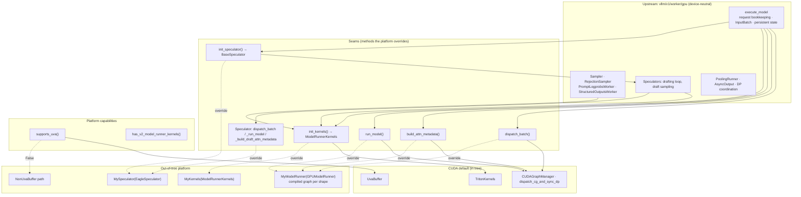
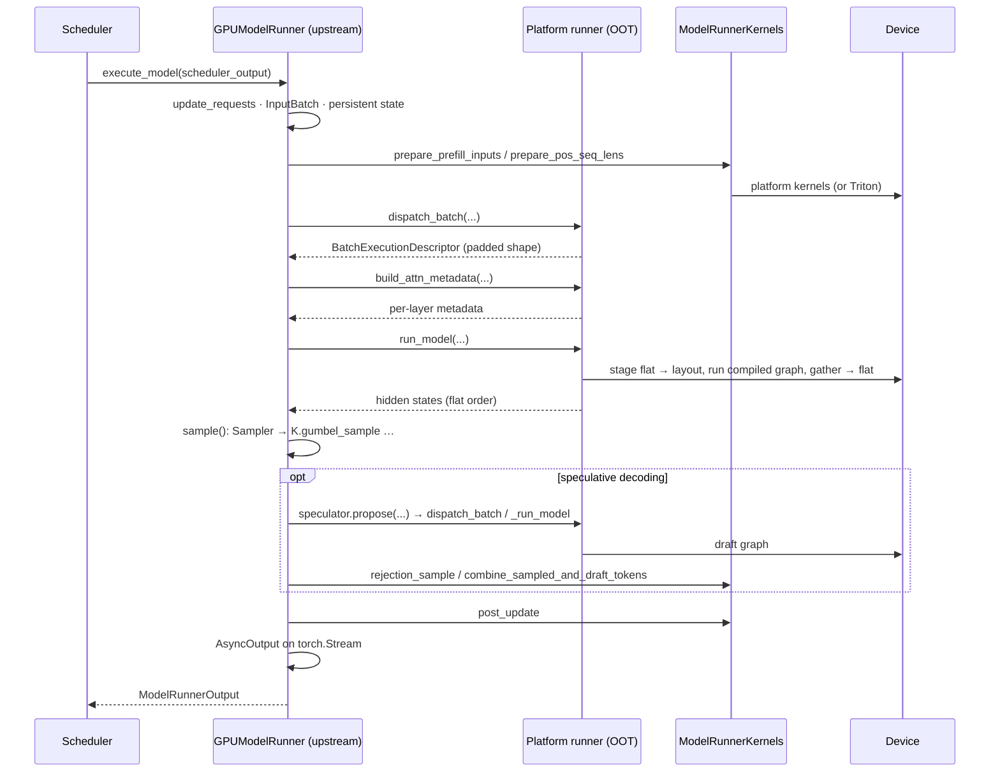

# Model Runner V2: Out-of-Tree Platform Design

Korean version: [model_runner_v2_oot_platforms.ko.md](model_runner_v2_oot_platforms.ko.md)

## Summary

[Model Runner V2](model_runner_v2.md) (MRV2) was written from first principles for CUDA. Most of what it contains is not CUDA at all: request bookkeeping, the persistent batch, block tables, the sampling algorithm, the speculative decoding loop, structured outputs, pooling. A small remainder is: the Triton kernels, the CUDA graph manager, UVA, and the choice of stream and event objects.

This document proposes how a non-CUDA platform plugs into MRV2 without copying or monkey-patching it. The proposal has one idea: **MRV2 owns the algorithm, the platform owns the device**, and the boundary between the two is a small set of named seams that upstream constructs and the platform overrides. Everything upstream keeps is device-neutral; everything the platform supplies is reached through a seam.

The design is written from scratch. It does not describe the current code, although a partial implementation exists and is referenced at the end.

## Goals and non-goals

Goals:

- A platform whose model executes as a compiled graph per shape, with logits computed inside the graph, runs MRV2 with request state, sampling, speculative decoding, structured outputs, pooling and DP unchanged.
- A platform without Triton supplies its kernels as one object and never touches a module global.
- In-tree behaviour on CUDA is unchanged, by construction: every seam is a verbatim move of code that exists today, and every default reproduces today's path.
- A platform that lacks a feature refuses it by name at startup instead of failing inside a step.

Non-goals:

- Making MRV2 run on a platform that cannot express its execution as a forward pass over `InputBatch`. That platform needs its own runner.
- Abstracting CUDA graphs. Graph capture is a CUDA feature and stays one; a platform with its own compiled-graph mechanism overrides the execution seam instead.
- Supporting every MRV2 feature on every platform. Pipeline parallelism, for example, needs a second device process group and `Tensor.record_stream`; a platform without them refuses PP rather than reimplementing it.

## Philosophy

Five principles decide every question below. When two answers look equally good, the one that follows more of these wins.

1. **The runner owns the algorithm; the platform owns the device.** MRV2 decides *what* a step needs: which requests, how many tokens, which rows of the persistent state, what to sample. The platform decides *how* the device does it: which graph runs, how tokens are laid out for it, which kernel implements `gumbel_sample`. A seam sits exactly where a "what" becomes a "how".

2. **Seams are methods, not flags.** A platform overrides a method whose name says what is being decided (`dispatch_batch`, `run_model`, `init_kernels`). MRV2 never asks `current_platform.is_cuda()` or `is_rbln()` to pick a branch. A flag creates a second copy of the logic inside upstream; a method keeps one copy upstream and moves the platform's copy out of tree, where it belongs.

3. **Upstream constructs, the platform selects.** Every device-bound object the runner needs (the kernel set, the speculator, the sampler and its helpers) is created through a factory method on the runner. The platform returns its own class from the factory. It never replaces an attribute after construction, never imports a symbol by path to overwrite it, and never has to know the order in which MRV2 builds things.

4. **Capability, not identity.** Where MRV2 must know something about the device, it asks a capability question (`supports_uva()`, `has_v2_model_runner_kernels()`), never a name. A capability has exactly one fallback path behind it, and that path exists only because a real platform lacks the capability.

5. **Device-neutral by default, CUDA where the feature is CUDA.** Streams, events, and synchronization use torch's generic API (`torch.Stream`, `torch.Event`, `torch.accelerator`). These are the same objects on CUDA. `torch.cuda.*` stays only where the feature is itself CUDA: graph capture, the cuBLAS handle. This is not a port; it is the removal of an accidental dependency.

## Invariants

These are the properties a reviewer can check on any change to MRV2 or to a platform. Each is testable.

| # | Invariant | How it is checked |
| --- | --- | --- |
| I1 | No module in the MRV2 stack calls `triton` outside `gpu/kernels.py`. Every kernel launch goes through `ModelRunnerKernels`. | grep for `triton` under `vllm/v1/worker/gpu/`, excluding `kernels.py` and files that are themselves CUDA-only. |
| I2 | The public methods of `TritonKernels` equal the abstract methods of `ModelRunnerKernels`. A kernel upstream adds is declared abstract in the same change. | A unit test compares the two sets. |
| I3 | Every device-bound object is constructed through an `init_*` factory on the runner, and the runner body imports no concrete device class except as a factory default. | Code review; a grep for `Sampler(`, `RejectionSampler(` outside factories. |
| I4 | No `is_<platform>()` branch exists in `vllm/v1/worker/gpu/`. | grep. |
| I5 | MRV2 hands the platform flat token order with `num_tokens_after_padding` rows and expects it back. A platform with another layout converts at the `run_model` boundary and nowhere else. | The speculator and sampler assume flat order; a layout leak fails their tests. |
| I6 | Request state, block tables, `InputBatch`, the sampling algorithm, and the drafting loop are never overridden by a platform. | The platform runner defines no method with those names; review. |
| I7 | A platform that cannot run a feature raises `NotImplementedError` naming the feature in `__init__`, before any state is allocated. | Unit test per refused feature. |
| I8 | Each seam is a verbatim move of code that ran before it existed; the default implementation is byte-equivalent to the inlined code. | Reviewed per seam PR; CUDA CI is the regression test. |

## Architecture



Read the diagram top down. The upstream box never changes for a platform. The seams box is the whole contract: six methods and two capability queries. The CUDA box is what the seams do by default. The out-of-tree box is what a platform writes; it is small, and every arrow into it comes from a seam.

## The seams

### Platform capabilities

Two questions on `Platform` gate paths that exist for platforms lacking the capability.

`has_v2_model_runner_kernels() -> bool` replaces the `HAS_TRITON` check in `use_v2_model_runner` and `_validate_v2_model_runner`. Default: `HAS_TRITON`. A platform that implements `ModelRunnerKernels` returns `True`.

`supports_uva() -> bool` replaces "pinned memory is available" as the UVA test. Default: CUDA-alike or XPU with pinned memory. When it is `False`, `UvaBuffer` becomes the existing `NonUvaBuffer` mirror, and the three call sites that address memory through raw `data_ptr()` tables (`FusedStagedWriter.apply`, `BlockTables.gather_block_tables`, `BlockTables.compute_slot_mappings`, plus `StagedWriteTensor.apply_write`) index their tensors directly when Triton is absent, because a platform kernel receives tensors and cannot dereference a pointer table.

There is no `is_cuda()` anywhere in the runner. If a third capability is ever needed, it is added here, with exactly one fallback behind it.

### Kernel interface

Every device kernel the MRV2 stack launches is a method of one abstract class:

```text
vllm/v1/worker/kernels.py          class ModelRunnerKernels(ABC)      # the contract
vllm/v1/worker/gpu/kernels.py      class TritonKernels(ModelRunnerKernels)   # CUDA, with the @triton.jit bodies
```

The runner obtains the implementation once, from `init_kernels()`, and hands it to every component that launches a kernel:

| Consumer | Kernels |
| --- | --- |
| `GPUModelRunner` (input preparation, post-update) | `prepare_prefill_inputs`, `prepare_pos_seq_lens`, `combine_sampled_and_draft_tokens`, `expand_idx_mapping`, `post_update`, `post_update_num_computed_tokens` |
| `Sampler` and its states (temperature, min-p, penalties, logit bias, bad words, logprobs) | `apply_temperature`, `apply_min_p`, `apply_penalties`, `bincount`, `apply_logit_bias`, `apply_bad_words`, `gumbel_sample`, `compute_token_logprobs`, `compute_token_ranks`, `fill_logprob_token_ids`, `get_num_nans`, `get_num_sampled_and_rejected` |
| `PromptLogprobsWorker` | `get_prompt_logprobs_token_ids` |
| `RejectionSampler` | `rejection_sample`, `flatten_sampled` |
| `StructuredOutputsWorker` | `apply_grammar_bitmask` |
| `AutoRegressiveSpeculator` | `prepare_draft_prefill_inputs`, `prepare_draft_decode_inputs`, `update_draft_inputs`; draft sampling reuses `gumbel_sample` |

Design rules for the interface:

- **One class, not one per consumer.** A platform ships one object. Splitting the interface per consumer would give a platform five classes to implement and the runner five factories to expose, for no gain: the kernels share helpers (`gumbel_sample`, `expanded_idx_mapping` conventions) and a platform's implementation shares a backend.
- **Signatures are the kernel's arguments, with tensors where the kernel took pointers** and Python ints where it took `constexpr`. `InputBuffers` and `InputBatch` are passed whole where the CUDA launch reads several of their fields; the platform unpacks what it needs.
- **A mutating kernel returns `None`; a producing kernel returns the tensor.** No kernel does both.
- **The kernels module holds kernel code only.** `@triton.jit` bodies and their launches live in `gpu/kernels.py`. The sampler, spec-decode and input-preparation modules hold device-neutral logic and call `self.kernels.<name>`. A module that held nothing but a kernel disappears.
- **A kernel with callers outside the runner stack keeps its module.** `rejection_sample` is called by watermarking and by tests; it stays where it is and the `TritonKernels` method calls it. The interface is what the *runner* needs, not a catalogue of every Triton kernel in vLLM.

Why an abstract class rather than a registry keyed by kernel name: a registry couples the platform to string names of private functions, gives no static check that a platform is complete, and makes a renamed kernel a silent runtime failure. An abstract class fails at `init_kernels()` with the missing method's name, and I2 keeps the two sides in step.

### Runner execution seams

Three decisions in `execute_model` are the ones a hardware runner must make its own way. Each is a method whose default body is the code that was inline before.

`dispatch_batch(scheduler_output, num_reqs, num_tokens, uniform_token_count, max_query_len, *, dummy_run, need_eager, num_active_loras, ...) -> BatchExecutionDescriptor` picks the shape the step runs at and agrees it across DP ranks. Default: `dispatch_cg_and_sync_dp`. A platform with compiled per-shape graphs returns the padded shape its graph set contains.

`build_attn_metadata(input_batch, batch_desc, block_tables, slot_mappings, attn_groups, *, for_capture=False) -> dict[str, AttentionMetadata]` builds per-layer attention metadata. Default: `model_state.prepare_attn(...)`. A platform whose attention builder needs host-side positions or a padded batch dimension computes them here, from the same `InputBatch` upstream just filled.

`run_model(batch_desc, input_batch, model_inputs, attn_metadata, ...) -> torch.Tensor | IntermediateTensors` runs the forward pass and returns hidden states in flat token order (I5). Default: the full-graph, piecewise, or eager branch. A platform stages the flat inputs into its graph's layout, runs the graph, and gathers the result back to flat order.

`sample(...)` is not a seam. The platform's `run_model` may compute logits inside the graph; if so it keeps them and overrides `sample` only to read them instead of calling `compute_logits`. This is the one place a platform touches sampling, and it touches only where the logits come from.

### Component construction

`init_kernels() -> ModelRunnerKernels`, default `TritonKernels()`. Set first in `__init__`, before any component that needs it.

`init_speculator() -> BaseSpeculator`, default the module-level `init_speculator(vllm_config, device, kernels)`. A platform returns its subclass of the upstream speculator.

The sampler, rejection sampler, prompt-logprobs worker and structured-outputs worker are constructed inline by upstream with `self.kernels` passed in. They are not factories: with the kernel object in hand, no platform has a reason to subclass them (I6). If one appears, the factory is added then, not speculatively.

Device-bound helpers that a platform may legitimately be unable to run are constructed through factories too, so that the platform can substitute or refuse: `init_pp_handler()` for the pipeline-parallel sampled-token broadcast, which needs a sibling device process group and `Tensor.record_stream`. A platform without either overrides the factory to raise, and the runner refuses PP at startup (I7).

### Speculator seams

`AutoRegressiveSpeculator` already separates its loop from its device work. Three methods complete the separation, mirroring the runner's:

- `dispatch_batch(num_reqs, num_tokens, uniform_token_count, *, decode, need_eager, ...) -> BatchExecutionDescriptor` picks the draft shape (default: `dispatch_cg_and_sync_dp`).
- `_run_model(...)` runs one draft pass (default: the graph or eager path).
- `_build_draft_attn_metadata(...)` builds the draft's attention metadata.

`init_cudagraph_manager()` and `capture()` are no-ops on a platform that has no CUDA graphs. The drafting loop, `propose`, draft sampling, EAGLE-3's auxiliary-state combination and draft-vocabulary mapping stay upstream and are inherited.

The speculator receives `kernels` in its constructor. It does not reach back into the runner for it: a speculator that needs the runner to function is a speculator that cannot be tested alone.

### Device primitives

`AsyncOutput`, `AsyncPoolingOutput`, `StructuredOutputsWorker`, `DraftTokensHandler`, `PPHandler`, `AdaptiveVerification` and the runner's main stream use `torch.Stream`, `torch.Event(device=..., blocking=True)`, `torch.accelerator.current_stream()` and `torch.accelerator.set_stream()`. On CUDA these resolve to the same objects as before. `cudagraph_utils` and `ubatch_utils` keep `torch.cuda`, because graph capture and the cuBLAS handle are CUDA features.

`Tensor.record_stream` is the one primitive a generic accelerator may not implement. The design does not paper over it: the two users (`PPHandler`, `DraftTokensHandler.set_draft_tokens`) either run on a platform with `record_stream`, or the platform refuses PP and patches the draft-token hand-off with a synchronous copy until its torch build implements the op.

## A step through the seams



Everything on the `R` lane is upstream and unchanged. Everything on the `P` lane is the platform's. `K` is one object, chosen once.

## Plugging in a platform

The whole out-of-tree surface, in outline:

```python
# my_platform/kernels.py
class MyKernels(ModelRunnerKernels):
    def apply_temperature(self, logits, expanded_idx_mapping, temperature) -> None:
        torch.ops.my.apply_temperature(logits, expanded_idx_mapping, temperature)
    # ... one method per abstract method; the ABC refuses to instantiate otherwise


# my_platform/model_runner.py
class MyModelRunner(GPUModelRunner):
    def __init__(self, vllm_config, device):
        unsupported = [name for name, on in (
            ("pipeline parallelism", vllm_config.parallel_config.pipeline_parallel_size > 1),
            ("LoRA", vllm_config.lora_config is not None),
        ) if on]
        if unsupported:
            raise NotImplementedError(f"MyModelRunner does not support {', '.join(unsupported)}")
        super().__init__(vllm_config, device)

    def init_kernels(self):
        return MyKernels()

    def init_speculator(self):
        return MySpeculator(self.vllm_config, self.device, self.kernels)

    def dispatch_batch(self, scheduler_output, num_reqs, num_tokens, ...):
        return self.pick_compiled_shape(num_reqs, num_tokens, ...)

    def build_attn_metadata(self, input_batch, batch_desc, ...):
        return self.attn_builder.build(...)

    def run_model(self, batch_desc, input_batch, model_inputs, attn_metadata, ...):
        staged = self.stage(model_inputs, layout=self.layout_for(batch_desc))
        logits, hidden = self.graphs[batch_desc](**staged)
        self._step_logits = logits
        return self.to_flat_order(hidden, batch_desc.num_tokens)


# my_platform/platform.py
class MyPlatform(Platform):
    def has_v2_model_runner_kernels(self) -> bool:
        return True

    def supports_uva(self) -> bool:
        return False
```

Nothing here imports a private upstream symbol or assigns to one.

## Explicitly CUDA

Three things deliberately get no seam.

**CUDA graph capture.** `CUDAGraphManager`, `dispatch_cg_and_sync_dp`, and `capture()` are CUDA. A platform with compiled graphs replaces the *decision* (`dispatch_batch`) and the *execution* (`run_model`), not the manager. Abstracting the manager would produce an interface with one real implementation and one no-op.

**The pipeline-parallel broadcast.** `PPHandler` needs a second device-side process group with the PP group's membership and `record_stream` to hand buffers across streams. Both are properties of the communicator and the torch build, not of MRV2. The design gives the platform a factory to refuse PP cleanly; it does not add a CPU-group broadcast path upstream that no CUDA user would run.

**`Tensor.record_stream`.** A torch extension that lacks it should add it. MRV2 uses it correctly and should not carry a synchronous alternative for a missing op.

## Testing and conformance

In tree:

- Every seam PR is a verbatim move; CUDA CI is the regression test (I8).
- A unit test asserts `set(public methods of TritonKernels) == ModelRunnerKernels.__abstractmethods__` (I2).
- A grep-based test asserts no `triton` import in `vllm/v1/worker/gpu/` outside `kernels.py` and CUDA-only modules (I1).

Out of tree, the platform is expected to run:

- The kernel conformance test: instantiate its `ModelRunnerKernels`; the ABC fails on any missing method.
- Per-kernel tests against a Python reference (the Triton kernel's documented semantics), on the host.
- MRV2 end-to-end against a HuggingFace reference for greedy decoding, prompt logprobs, and pooling; against its own V1-era runner for batched decode where the two must agree; and a refusal test per feature it does not support.

## Alternatives considered

| Alternative | Why not |
| --- | --- |
| Kernel registry keyed by qualified name, consulted by a placeholder `@triton.jit` object at launch | Stringly typed; no completeness check; a renamed kernel fails at runtime in a step. |
| One factory and one subclass per component (`init_sampler`, `init_rejection_sampler`, …) with kernel methods on each class | Five factories and five subclasses for what is one object; the platform reimplements the same delegation five times; upstream cannot add a component without adding a factory. |
| `Platform.get_model_runner_kernels()` instead of `init_kernels()` on the runner | Moves a runner concern onto `Platform`, which then imports worker code; the runner is where the other device decisions already live. |
| Platform subclass of `GPUModelRunner` that copies `execute_model` | The state of the art before this design: a 1,300-line copy that drifts on every upstream change. |
| `torch.cuda.*` aliased to the platform's namespace process-wide | Works until a genuine CUDA feature (graph capture) is reached, then fails obscurely; hides which code is device-neutral. |

## Rollout

Each step is independently mergeable and behaviour-preserving on CUDA.

1. Capabilities: `has_v2_model_runner_kernels()`, `supports_uva()`, the non-UVA and non-Triton fallbacks at the pointer-table sites.
2. Device-neutral streams and events.
3. Runner seams: `dispatch_batch`, `build_attn_metadata`, `run_model`, `init_speculator`.
4. Speculator seams: `dispatch_batch`, `_run_model`, `_build_draft_attn_metadata` on `AutoRegressiveSpeculator`; `kernels` in the speculator constructor.
5. `ModelRunnerKernels`, `TritonKernels`, `init_kernels()`; kernel bodies move into `gpu/kernels.py`; components take `kernels`.
6. Factories for refusable helpers (`init_pp_handler`).
7. Conformance tests for I1 and I2.

Steps 1 to 5 exist as a working implementation in one platform plugin and are the basis of this proposal; steps 6 and 7 are proposed here for the first time.

## Open questions

- Should `ModelRunnerKernels` be versioned, so a platform can declare which upstream release its implementation targets and fail early on a signature change?
- `InputBuffers` and `InputBatch` are passed whole to the draft kernels. Should the interface pass fields instead, at the cost of longer signatures, so that a platform never depends on those classes' layout?
- Is a `Platform` capability for `record_stream` worth adding, so that `DraftTokensHandler` can choose a synchronous copy upstream rather than each platform patching it?
